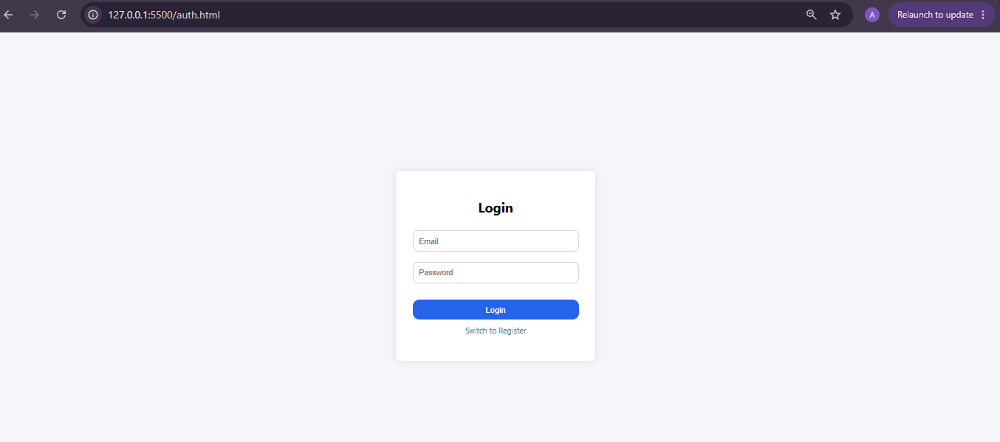
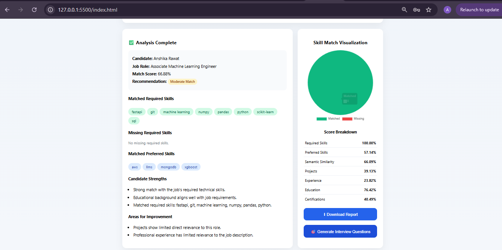

# 🧠 AI Resume Screener

AI Resume Screener is a full-stack AI-powered web application that analyzes resumes against job descriptions and provides intelligent, explainable candidate evaluations.

It combines resume parsing, job description analysis, semantic matching, multi-factor scoring, skill-gap analysis, and interview question generation to create a complete AI-assisted resume screening workflow.

---

## 🚀 Project Overview

Traditional resume screening often relies heavily on manual review or simple keyword matching. AI Resume Screener improves this process by analyzing both the candidate's resume and the target job description.

The system extracts structured information from resumes and job descriptions, performs semantic and skill-based matching, and generates an overall compatibility score along with strengths, weaknesses, missing skills, and a hiring recommendation.

The application also provides screening history and personalized interview questions based on the candidate's profile and target role.

---

## ✨ Features

- 📄 **Resume Parsing** – Extracts candidate details, skills, education, experience, projects, and certifications.
- 💼 **Job Description Analysis** – Identifies job title, required skills, preferred skills, experience, education, and responsibilities.
- 🧠 **Semantic Matching** – Uses Sentence Transformer embeddings to measure contextual similarity between resumes and job descriptions.
- 📊 **Explainable Candidate Scoring** – Evaluates required skills, preferred skills, projects, experience, education, certifications, and semantic similarity.
- 🎯 **Skill Gap Analysis** – Identifies matched and missing skills for the target role.
- 💡 **Candidate Insights** – Generates strengths, weaknesses, and an overall hiring recommendation.
- 🎤 **Interview Intelligence** – Generates personalized technical, project, experience, skill-gap, and behavioral interview questions.
- 📚 **Screening History** – Stores previous candidate screening results for authenticated users.
- 🔐 **JWT Authentication** – Supports secure user registration, login, and protected application features.
- 📑 **PDF Reports** – Allows screening results to be downloaded for later review.
- 🧪 **Automated Testing & CI** – Backend functionality is tested using Pytest and validated through GitHub Actions.

---

## 🛠️ Technologies Used

### Frontend
- HTML
- CSS
- JavaScript
- Chart.js

### Backend
- Python
- FastAPI
- Pydantic
- SQLAlchemy

### AI / NLP
- Sentence Transformers
- Scikit-Learn
- NLP-based text processing
- Semantic similarity and embeddings

### Database & Authentication
- SQLite
- JWT
- bcrypt

### Tools & DevOps
- Git & GitHub
- Pytest
- GitHub Actions
- Docker / Docker Compose configuration

---

## 🏗️ Project Structure

```text
ai-resume-screener/
│
├── backend/
│   ├── app/
│   │   ├── api/               # V2 API routes
│   │   ├── ml/                # Embedding models
│   │   ├── schemas/           # Data schemas
│   │   └── services/          # Parsing, matching & intelligence services
│   │
│   ├── main.py                # FastAPI application
│   ├── auth.py                # JWT authentication
│   ├── database.py            # Database configuration
│   └── models.py              # Database models
│
├── frontend-html/
│   ├── index.html             # Main screening dashboard
│   ├── auth.html              # Authentication page
│   ├── script.js              # Application logic
│   ├── auth.js                # Authentication logic
│   └── style.css              # Styling
│
├── tests/
│   ├── test_api.py
│   └── test_intelligence.py
│
├── .github/
│   └── workflows/
│       └── ci.yml             # GitHub Actions CI
│
├── Dockerfile
├── docker-compose.yml
├── .env.example
├── requirements.txt
└── README.md
```

---

## ⚙️ How It Works

1. The user logs into the application and uploads a resume.
2. The resume parser extracts structured candidate information.
3. The user provides the target job description.
4. The JD parser extracts required and preferred job requirements.
5. The matching engine performs skill-based and semantic comparison.
6. The ranking engine calculates an explainable compatibility score.
7. The application displays matched skills, skill gaps, strengths, weaknesses, and the final recommendation.
8. Users can save screening results, download reports, and generate personalized interview questions.

---

## 🔄 Project Evolution

The initial version focused on resume parsing and basic candidate evaluation.

The upgraded version extends the project into an AI-powered hiring intelligence system with structured JD parsing, semantic matching, explainable multi-factor scoring, authentication, screening history, interview intelligence, automated testing, and CI.

---

## 📸 Screenshots

### Authentication


### Candidate Screening


### Interview Intelligence


---

## 👩‍💻 Author

**Anshika Rawat**
B.Tech – Artificial Intelligence & Machine Learning